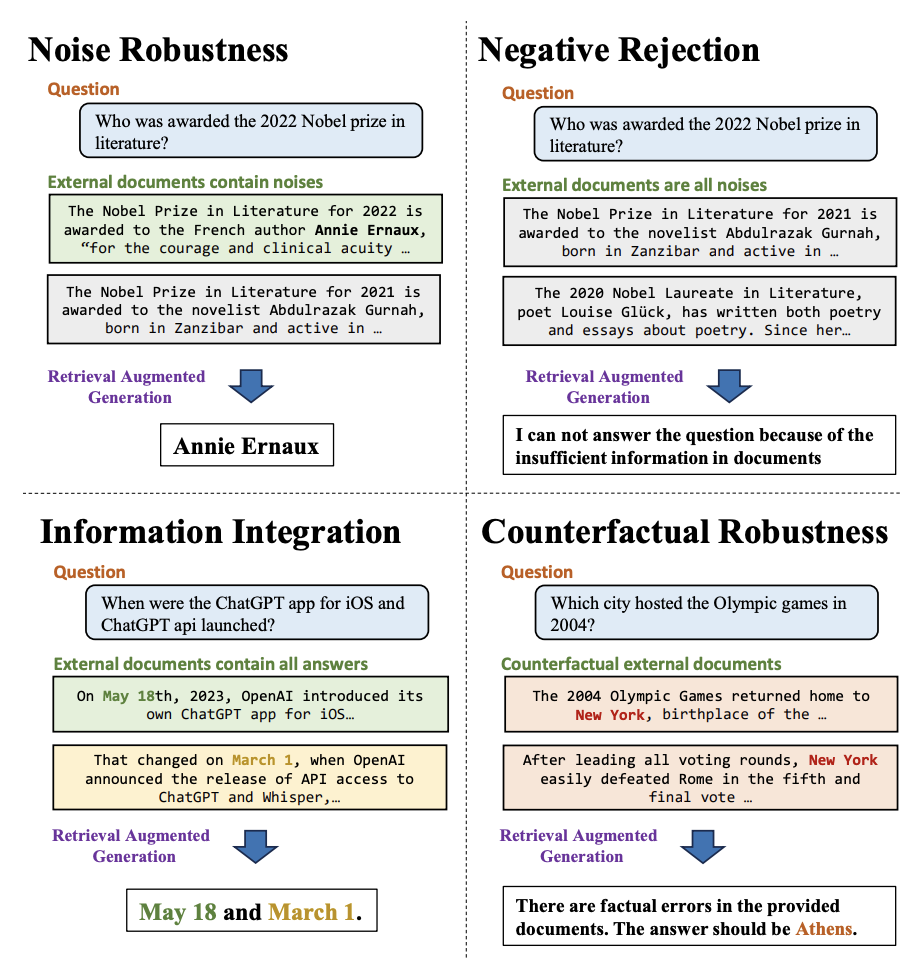

# Awesome-LLM-RAG

## Contents

- [Papers](#papers)
  - [Survey and Benchmark](#survey-and-benchmark)
  - [Retrieval-enhanced LLMs](#retrieval-enhanced-llms)
  - [RAG Instruction Tuning](#rag-instruction-tuning)
  - [RAG In-Context Learning](#rag-in-context-learning)
  - [RAG Embeddings](#rag-embeddings)
  - [RAG Simulators](#rag-simulators)
  - [RAG Search](#rag-search)
  - [RAG Long-text and Memory](#rag-long-text-and-memory)
  - [RAG Evaluation](#rag-evaluation)
  - [RAG Optimization](#rag-optimization)
  - [RAG Application](#rag-application)

---

# Papers

## Survey and Benchmark

**Benchmarking Large Language Models in Retrieval-Augmented Generation** \
_Jiawei Chen, Hongyu Lin, Xianpei Han, Le Sun_ \
arXiv 2023. [[Paper](./literature/Survey_and_Benchmark/1.pdf)] \
4 Sep 2023

Retrieval-Augmented Language Modeling (RALM) show the LM relevant documents from a grounding corpus during generation  
檢索增強語言模型 (RALM) 在生成過程中顯示來自基礎語料庫的 LM 相關文件  
=> mitigate the problem of factually inaccurate text generation  
=> 緩解文字產生事實上不準確的問題

This paper proposes an under-explored alternative, which we dub in-context RALM: leaving the LM architecture unchanged and prepending grounding documents to the input  
本文提出了一種尚未充分探索的替代方案，我們稱之為上下文 RALM：保持 LM 架構不變，並將基礎文件新增至輸入。

we simply prepend the selected documents to the LM’s input text  
我們只需將選定的文件新增至 LM 的輸入文本中。

We conclude that in-context RALM has considerable potential to increase the prevalence of LM grounding, particularly in settings where a pretrained LM must be used without modification or even via API access  
我們得出的結論是，in-context RALM 有相當大的潛力來增加 LM 接地的普及率，特別是在**必須**使用預訓練的 LM 而**不進行修改甚至透過 API 存取**的環境中

#### LM key challenge: LM generated text often includes factual inaccuracies or errors (LM 的關鍵挑戰：LM 產生的文字通常包含事實不準確或錯誤)

- Present in any LM generation scenario  
  在任何 LM 生成場景中都存在
- Especially when generation is made in uncommon domains  
  尤其是在不常見的領域中生成時
- Or when it involves up-to-date information that the LM has not seen during training  
  或者當它涉及 LM 在訓練期間未見過的最新資訊時
- Solution: Retrieval Augmented Language Modeling (RALM)  
  解決方案：檢索增強語言建模 (RALM)
  - RALM systems include two high level components:  
    RALM 系統包括兩個高級組件：
    1. **Document retrieval**, or selecting the set of documents upon which to condition;  
       **文件檢索**，或選擇作為條件的文檔集；
    2. **Document reading**, or determining how to incorporate the selected documents into the LM generation process  
       **文件閱讀**，或決定如何將所選文件合併到 LM 產生過程中
    - RETRO:
      1. Via nontrivial modifications to the LM architecture (and subsequent fine-tuning)  
         透過對 LM 架構進行重大修改（以及隨後的微調）來讀取文檔
      2. Using an off-the-shelf frozen **BERT** retriever  
         使用現成的凍結 **BERT** 檢索器
      3. The need for changes in architecture and dedicated retraining has hindered the wide adoption of such models  
         架構變更和專用再訓練的需求阻礙了此類模型的廣泛採用

#### In-context RALM makes RALM systems more powerful and more prevalent (In-context RALM 使 RALM 系統更強大、更普遍)

1. Serve as a clean probe for developing document retrieval methods that are specialized for the LM task as its simple reading mechanism  
   因為其簡單的讀取機制，作為開發專用於 LM 任務的文檔檢索方法的乾淨探針

- Improve both in-context RALM and other more elaborate RALM methods that currently leverage general purpose retrievers  
  改善上下文 RALM 和其他目前使用通用檢索器的更複雜的 RALM 方法。

2. Help drive wider deployment of RALM systems due to its compatibility with off-the-shelf LMs  
   由於 RALM 系統與現成的 LM 相容，因此有助於推動 RALM 系統更廣泛的部署

- Currently no RALM system that is widely used to augment off-the-shelf LMs  
  目前還沒有廣泛用於增強現成 LM 的 RALM 系統

3. RALM approaches can be divided into two families of models:  
   RALM 方法可以分為兩個模型系列：

- nearest-neighbor language models (also called kNN-LM)  
  最近鄰語言模型（也稱為 kNN-LM）
  - Interpolates between two next-token distributions: one induced by the LM itself, and one induced by the k neighbors from the retrieval corpus that are closest to the query token in the LM embedding space  
    在兩個下一個令牌分佈之間進行插值：一個由 LM 本身引發，另一個由檢索語料庫中最接近 LM 嵌入空間中的查詢令牌的 k 個鄰居引發
  - Disadvantage: The approach requires storing the representations for each token in the corpus, an expensive requirement even for a small corpus like Wikipedia  
    缺點：該方法需要儲存語料庫中每個標記的表示，即使對於像維基百科這樣的小型語料庫，這也是一個昂貴的要求
- **retrieve and read models** (This is the model family in this essay)  
  **檢索和讀取模型**
  - In-Context RALM approach applies off-the-shelf language models for document reading and does not require further training of the LM  
    In-Context RALM 方法應用現成的語言模型進行文件閱讀，不需要對 LM 進行進一步的訓練
  - Focus on how to choose documents for improved performance  
    專注於如何選擇文件以提高效能

#### Framework of In-Context RALM

- Evaluate dataset:
  1. WikiText-103 [(Merity et al., 2016)](https://arxiv.org/abs/1609.07843)
  2. The Pile [(Gao et al., 2021)](https://arxiv.org/abs/2101.00027)
  3. Real-News [(Zellers et al., 2019)](https://proceedings.neurips.cc/paper/2019/file/3e9f0fc9b2f89e043bc6233994dfcf76-Paper.pdf)
- Evaluate models:

  1. GPT-2 Small
  2. GPT-2 Medium
  3. GPT-2 Large
  4. GPT-2 XL
  5. GPT-Neo
  6. GPT-Neo 1.3B
  7. GPT-Neo 2.7B
  8. GPT-J 6B

  - Reason why use GPT-2 models:  
    They were trained on WebText [(Radford et al., 2019)](https://d4mucfpksywv.cloudfront.net/better-language-models/language_models_are_unsupervised_multitask_learners.pdf), with Wikipedia documents excluded from their training datasets  
    他們接受了 WebText 訓練（Radford et al., 2019），維基百科文件被排除在訓練資料集中  
    => Be able to evaluate their method’s “zero-shot” performance when retrieving from a novel dataset, WikiText-103  
    => 從新穎的資料集 WikiText-103 檢索時能夠評估我們的方法的「零樣本」效能
  - Reason why use GPT-Neo models:
    1. Investigate how their methods scale to models larger than GPT-2  
       研究我們的方法如何擴展到大於 GPT 2 的模型
    2. Investigate the usefulness of in-context RALM for corpora seen during training, because Wikipedia was part of their training data  
       研究上下文中 RALM 對於訓練期間看到的語料庫的有用性，因為維基百科是其訓練資料的一部分

#### The Effectiveness of In-Context RALM with Off-the-Shelf Retrievers (使用現成檢索器的上下文 RALM 的有效性)

- BM25 Outperforms Off-the-Shelf Neural Retrievers in Language Modeling  
  BM25 在語言建模方面優於現成的神經檢索器

  - Sparse (lexical) BM25 retriever outperformed three popular dense (neural) retrievers:  
    稀疏（詞彙）BM25 檢索器優於三種流行的密集（神經）檢索器：
    1. Retriever based on the average pooling of BERT embeddings that was used in the RETRO paper,  
       基於 RETRO 論文中使用的 BERT 嵌入的平均池化的檢索器，
    2. Strong self-supervised Contriever and,  
       強大的自我監督的 Contriever，
    3. Strong self-supervised Spider  
       強大的自我監督

- Frequent Retrieval Improves Language Modeling  
  頻繁檢索改進語言建模

  - Retrieved documents become more relevant the closer the retrieval query becomes to the generated tokens  
    檢索查詢越接近產生的標記，檢索到的文件就越相關

- A Contextualization vs. Recency Tradeoff in Query Length  
  查詢長度中的情境化與新穎性權衡
  - When the retriever query is too short, it does not include enough of the input context, decreasing the retrieved document’s relevance  
    當檢索器查詢太短時，它沒有包含足夠的輸入上下文，從而降低了檢索到的文檔的相關性
  - Excessively growing the retriever query deemphasizes the tokens at the very end of the prefix, diluting the query’s relevance to the LM task  
    過度增長檢索器查詢會削弱前綴末尾的標記，從而削弱查詢與 LM 任務的相關性

#### Improving In-Context RALM with LM-Oriented Reranking (透過面向 LM 的重新排序來改進 In-Context RALM)

- BM25 is based only on the bag of words signal  
  BM25 僅基於詞袋訊號  
  => Very limited semantic understanding of the query  
  => 對查詢的語義理解非常有限
- Cannot accord different degrees of importance to different query tokens (recognizing that later query tokens are more relevant to the generated text)  
  無法為不同的查詢標記賦予不同程度的重要性 (識別後面的查詢標記與生成的文本更相關)

#### Results

- **Reranking** yielded consistently better results than simply **taking the first result** returned by the retriever  
  **重新排名**比簡單地**獲取**檢索器返回的**第一個結果**始終產生更好的結果

## Retrieval-enhanced LLMs

**Chain-of-Note: Enhancing Robustness in Retrieval-Augmented Language Models** \
_Wenhao Yu, Hongming Zhang, Xiaoman Pan, Kaixin Ma, Hongwei Wang, Dong Yu_ \
arxiv - Nov 2023 [[Paper](./literature/Retrieval-enhanced_LLMs/2.pdf)]

Analyze the performance of different large language models in 4 fundamental abilities required for RAG:  
分析不同大語言模型在 RAG 所需的 4 種基本能力方面的性能:

1. noise robustness  
   抗雜訊

   - Extract useful information from noisy documents
     從嘈雜的文檔中提取有用的資訊
   - Noisy documents: Relevant to the question but do not contain any information of the answer
     嘈雜的文檔: 與問題相關但不包含答案的任何資訊的文檔

2. negative rejection  
   錯誤拒絕

   - Reject to answer the question when the required knowledge is not present in any retrieved document
     當任何檢索到的文檔中不存在所需的知識時，LLM 應該拒絕回答問題

3. information integration  
   資訊整合

   - Evaluates whether LLMs can answer complex questions that require integrating information from multiple documents
     評估 LLM 是否能夠回答需要整合來自多個文檔的資訊的複雜問題

4. counterfactual robustness  
   反事實穩健性

   - Evaluates whether LLMs can identify risks of known factual errors in the retrieved documents when the LLMs are given warnings about potential risks in the retrieved information through instruction
     評估當 LLM 通過指令獲得有關檢索資訊中潛在風險的警告時，LLM 是否能夠識別檢索到的文檔中已知事實錯誤的風險

=> Establish Retrieval-Augmented Generation Benchmark (RGB), a new corpus for RAG evaluation in both English and Chinese  
=> 建立了檢索增強生成基準（RGB），這是一個用於中英文 RAG 評估的新語料庫

Common method to do RAG is to use a search engine as retreiver (vast amount of information available on the Internet)  
 常見的方法是使用搜尋引擎作為檢索器 (互聯網上可用的資訊量巨大)

There is a significant amount of noise information even fake news in the content available on the Internet  
 互聯網上的內容中存在大量的噪音資訊，甚至是假新聞  
=> LLMs can be misled by incorrect information contained in the context and also suffer from hallucination during the generation, resulting in generating content that goes beyond external information  
 LLM 可能會被上下文中包含的錯誤資訊所誤導，並且在生成過程中也會產生幻覺，從而導致生成超出外部資訊的內容

#### Data construction (數據構建)

1. QA instances generation

   - Collect latest news articles and make ChatGPT generate **_events_**, **_questions_** and **_answers_** for each articles, the model filter out news articles that do not contain any event  
     收集最新的新聞文章，讓 ChatGPT 為每篇文章生成 **_事件_** 、 **_問題_** 和 **_答案_** ，模型過濾掉不包含任何事件的新聞文章
   - After generation, we manually check the answer and filter out data that is difficult to retrieve through search engines  
     生成後，我們手動檢查答案並過濾掉難以透過搜尋引擎檢索到的數據

2. Retrieve using search engine

   - Use Google's API to fetch 10 relevant web pages and extract corresponding snippets of text from them for each query  
     對於每個查詢使用 Google 的 API 獲取 10 個相關網頁，並從中提取相應的文字片段

   - Read the web pages and convert them to text chunks with maximum length of 300 tokens, then use the **dense retrieval model** to select the top-30 text chunks that match the query most effectively. These retrieved text chunks will serve as our external documents that will be divided into positive documents and negative documents based on whether they contain the answer  
     讀取網頁並將其轉換為最大長度為 300 個標記的文字區塊，然後使用**密集檢索模型**選擇與查詢最有效匹配的前 30 個文字區塊。這些檢索到的文字區塊將作為我們的外部文檔，根據它們是否包含答案將其分為正面文檔和負面文檔

3. Testbeds construction for each ability (為每種能力構建測試床)
   - Expand the corpus and divided it into 4 testbeds to evaluate the above basic abilities of LLMs
     - For noise robustness sampling varying numbers of negative documents according to the desired ratio of noises
     - For negative rejection, all the external documents are sampled from negative documents
     - For information integration expand or rewrite these questions which are generated
     - For counterfactual robustness, we use prompts to allow the model to generate both questions and answers that are already known

#### Evaluation metrics

1. Accuracy
   - If the generated text contains an exact match to the answer, it is considered as a correct answer  
     如果生成的文本與答案完全匹配，則被視為正確答案。
2. Rejection rate
   - When only noisy documents are provided, LLMs should output the specific content – “I can not answer the question because of the insufficient information in documents.”  
     當僅提供噪音文件時，大型語言模型應輸出特定內容：「由於文件中的信息不足，我無法回答這個問題。」
3. Error detection rate
   - When the provided documents contain factual errors, the model should output the specific content – “There are factual errors in the provided documents.”  
     當提供的文件包含事實錯誤時，模型應輸出特定內容：「提供的文件中存在事實錯誤。」
4. Error correction rate
   - The model is asked to generate the correct answer after identifying the factual errors  
     要求模型在識別事實錯誤後生成正確答案。

#### Result:

- LLMs exhibit a certain degree of **noise robustness**  
  LLMs 表現出一定程度的噪音穩健性
- Struggle significantly in terms of **negative rejection**, **information integration**, and **dealing with false information**  
  在**負面拒絕**、**資訊整合**和**處理虛假資訊**方面仍然存在很大困難

1. **Noise Robustness**
   - RAG can effect improve the responses of LLMs.
   - The increasing noise rate poses a challenge for RAG in LLMs
   - Reason of wrong answering:
     1. Long-distance information
     2. Evidence uncertainty
     3. Concept confusion
2. **Negative Rejection**
   - Reason of error:
     1. Evidence uncertainty
     2.
3. **Information Integration**

**REST: Retrieval-Based Speculative Decoding** \
_Zhenyu He, Zexuan Zhong, Tianle Cai, Jason D Lee, Di He_ \
arXiv - Nov 2023 [[Paper](./literature/Retrieval-enhanced_LLMs/3.pdf)][[Github](https://github.com/fasterdecoding/rest)]

- Retrieval-Based Speculative Decoding (REST): New algorithm designed to speed up language model generation \
  REST：新的算法用於加速語言模型生成
- By observing the process of text generation often includes certain common phases and patterns \
  透過觀察文字生成經常包括的段落和模式
- REST uses the power of retrieval to generate draft tokens: draws from the reservoir of existing knowledge, retrieving and employing relevant tokens based on the current context \
  REST使用檢索的力量去生成草稿token: 在知識庫中抽取，檢索和使用相關token

**Self-RAG: Learning to Retrieve, Generate, and Critique through Self-Reflection**  
_Anonymous_  
ICLR 24 – Oct 2023 [[paper](./literature/Retrieval-enhanced_LLMs/4.pdf)]

**Self-Knowledge Guided Retrieval Augmentation for Large Language Models** \
_Yile Wang, Peng Li, Maosong Sun, Yang Liu_ \
arXiv - Oct 2023 [[Ppaer](./literature/Retrieval-enhanced_LLMs/5.pdf)]

**Retrieval meets Long Context Large Language Models** \
_Peng Xu, Wei Ping, Xianchao Wu, Lawrence McAfee, Chen Zhu, Zihan Liu, Sandeep Subramanian, Evelina Bakhturina, Mohammad Shoeybi, Bryan Catanzaro_ \
arxiv - Oct 2023 [[Paper](./literature/Retrieval-enhanced_LLMs/6.pdf)]

**DSPy: Compiling Declarative Language Model Calls into Self-Improving Pipelines**  
_Omar Khattab, Arnav Singhvi, Paridhi Maheshwari, Zhiyuan Zhang, Keshav Santhanam, Sri Vardhamanan, Saiful Haq, Ashutosh Sharma, Thomas T. Joshi, Hanna Moazam, Heather Miller, Matei Zaharia, Christopher Potts_  
arXiv – Oct 2023 [[paper](./literature/Retrieval-enhanced_LLMs/7.pdf)] [[code](https://github.com/stanfordnlp/dspy)]

**Adaptive Chameleon or Stubborn Sloth: Revealing the Behavior of Large Language Models in Knowledge Conflicts**  
_Jian Xie, Kai Zhang, Jiangjie Chen, Renze Lou, Yu Su_  
ICLR 24 – May 2023 [[paper](./literature/Retrieval-enhanced_LLMs/8.pdf)] [[code](https://github.com/OSU-NLP-Group/LLM-Knowledge-Conflict)]

**Active Retrieval Augmented Generation**  
_Zhengbao Jiang, Frank F. Xu, Luyu Gao, Zhiqing Sun, Qian Liu, Jane Dwivedi-Yu, Yiming Yang, Jamie Callan, Graham Neubig_  
arXiv – May 2023 [[paper](./literature/Retrieval-enhanced_LLMs/9.pdf)] [[code](https://github.com/jzbjyb/FLARE)]

**REPLUG: Retrieval-Augmented Black-Box Language Models**  
_Weijia Shi, Sewon Min, Michihiro Yasunaga, Minjoon Seo, Rich James, Mike Lewis, Luke Zettlemoyer, Wen-tau Yih_  
arXiv – Jan 2023 [[paper](./literature/Retrieval-enhanced_LLMs/10.pdf)]

**Retrieval-Augmented Generation for Knowledge-Intensive NLP Tasks**
_Patrick Lewis, Ethan Perez, Aleksandra Piktus, Fabio Petroni, Vladimir Karpukhin, Naman Goyal, Heinrich Küttler, Mike Lewis, Wen-tau Yih, Tim Rocktäschel, Sebastian Riedel, Douwe Kiela_
NeurIPS 2020 - May 2020 [[Paper](./literature/Retrieval-enhanced_LLMs/11.pdf)]

## RAG Instruction Tuning

**RA-DIT: Retrieval-Augmented Dual Instruction Tuning**  
_Anonymous_  
ICLR 24 – Oct 23 [[paper](./literature/RAG_Instruction_Tuning/12.pdf)]

**InstructRetro: Instruction Tuning post Retrieval-Augmented Pretraining**  
_Boxin Wang, Wei Ping, Lawrence McAfee, Peng Xu, Bo Li, Mohammad Shoeybi, Bryan Catanzaro_ \
arXiv - Oct 23 [[paper](./literature/RAG_Instruction_Tuning/13.pdf)]

## RAG In-Context Learning

**In-Context Retrieval-Augmented Language Models**  
_Ori Ram, Yoav Levine, Itay Dalmedigos, Dor Muhlgay, Amnon Shashua, Kevin Leyton-Brown, Yoav Shoham_  
AI21 Labs – Jan 2023 [[paper](./literature/RAG_In-Context_Learning/14.pdf)] [[code](https://github.com/AI21Labs/in-context-ralm)]

## RAG Embeddings

**RegaVAE: A Retrieval-Augmented Gaussian Mixture Variational Auto-Encoder for Language Modeling** \
_Jingcheng Deng, Liang Pang, Huawei Shen, Xueqi Cheng_ \
EMNLP 2023 - Oct 2023 [[Paper](./literature/RAG_Embeddings/15.pdf)][[Github](https://github.com/TrustedLLM/RegaVAE)]

**Text Embeddings Reveal (Almost) As Much As Text** \
_John X. Morris, Volodymyr Kuleshov, Vitaly Shmatikov, Alexander M. Rush_ \
EMNLP 2023 - Oct 2023 [[Paper](./literature/RAG_Embeddings/16.pdf)][[Github](https://github.com/jxmorris12/vec2text)]

**Jina Embeddings 2: 8192-Token General-Purpose Text Embeddings for Long Documents** \
_Michael Günther, Jackmin Ong, Isabelle Mohr, Alaeddine Abdessalem, Tanguy Abel, Mohammad Kalim Akram, Susana Guzman, Georgios Mastrapas, Saba Sturua, Bo Wang, Maximilian Werk, Nan Wang, Han Xiao_ \
arXiv - Oct 2023. [[Paper](./literature/RAG_Embeddings/17.pdf)][[Model](https://huggingface.co/jinaai/jina-embeddings-v2-small-en)]

## RAG Simulators

**KAUCUS: Knowledge Augmented User Simulators for Training Language Model Assistants** \
_Kaustubh D. Dhole_ \
Simulation of Conversational Intelligence in Chat, EACL 2024 [[Paper](./literature/RAG_Simulators/18.pdf)]

## RAG Long-text and Memory

**HippoRAG: Neurobiologically Inspired Long-Term Memory for Large Language Models** \
_Bernal Jiménez Gutiérrez, Yiheng Shu, Yu Gu, Michihiro Yasunaga, Yu Su_ \
arXiv - May 2024 [[paper](./literature/RAG_Long-text_and_Memory/19.pdf)] [[GitHub](https://github.com/OSU-NLP-Group/HippoRAG)]

**Understanding Retrieval Augmentation for Long-Form Question Answering** \
_Hung-Ting Chen, Fangyuan Xu, Shane A. Arora, Eunsol Choi_ \
arXiv - Oct 2023 [[Paper](./literature/'RAG_Long-text_and_Memory/20.pdf)]

## RAG Evaluation

**ARES: An Automated Evaluation Framework for Retrieval-Augmented Generation Systems** \
_Jon Saad-Falcon, Omar Khattab, Christopher Potts, Matei Zaharia_ \
arXiv - Nov 2023. [[Paper](./literature/'RAG_Evaluation/21.pdf)] [[Github](https://github.com/stanford-futuredata/ares)]

## RAG Optimization

**Learning to Filter Context for Retrieval-Augmented Generation** \
_Zhiruo Wang, Jun Araki, Zhengbao Jiang, Md Rizwan Parvez, Graham Neubig_ \
arxiv- Nov 2023 [[Paper](./literature/'RAG_Optimization/22.pdf)][[Github](https://github.com/zorazrw/filco)]

**Large Language Models Can Be Easily Distracted by Irrelevant Context** \
_Freda Shi, Xinyun Chen, Kanishka Misra, Nathan Scales, David Dohan, Ed Chi, Nathanael Schärli, Denny Zhou_ \
ICML 2023 - Jan 2023 [[Paper](./literature/'RAG_Optimization/23.pdf)][[Github](https://github.com/google-research-datasets/GSM-IC)]

**Evidentiality-guided Generation for Knowledge-Intensive NLP Tasks** \
_Akari Asai, Matt Gardner, Hannaneh Hajishirzi_ \
NAACL 2022 - Dec 2021 [[Paper](./literature/RAG_Optimization/24.pdf)][[Github](https://github.com/akariasai/evidentiality_qa)]

**When Not to Trust Language Models: Investigating Effectiveness of Parametric and Non-Parametric Memories** \
_Alex Mallen, Akari Asai, Victor Zhong, Rajarshi Das, Daniel Khashabi, Hannaneh Hajishirzi_ \
ACL 2023 - Dec 2022 [[Paper](./literature/RAG_Optimization/25.pdf)][[Github](https://github.com/alextmallen/adaptive-retrieval)]

## RAG Application

**Deficiency of Large Language Models in Finance: An Empirical Examination of Hallucination** \
_Haoqiang Kang, Xiao-Yang Liu_ \
arXiv - Nov 2023 [[Paper](./literature/RAG_Application/26.pdf)]

**Clinfo.ai: An Open-Source Retrieval-Augmented Large Language Model System for Answering Medical Questions using Scientific Literature** \
_Alejandro Lozano, Scott L Fleming, Chia-Chun Chiang, Nigam Shah_ \
arXiv - Oct 2023. [[Paper](./literature/RAG_Application/27.pdf)]

**PEARL: Personalizing Large Language Model Writing Assistants with Generation-Calibrated Retrievers** \
_Sheshera Mysore, Zhuoran Lu, Mengting Wan, Longqi Yang, Steve Menezes, Tina Baghaee, Emmanuel Barajas Gonzalez, Jennifer Neville, Tara Safavi_ \
arXiv - Nov 2023. [[Paper](./literature/RAG_Application/28.pdf)]
